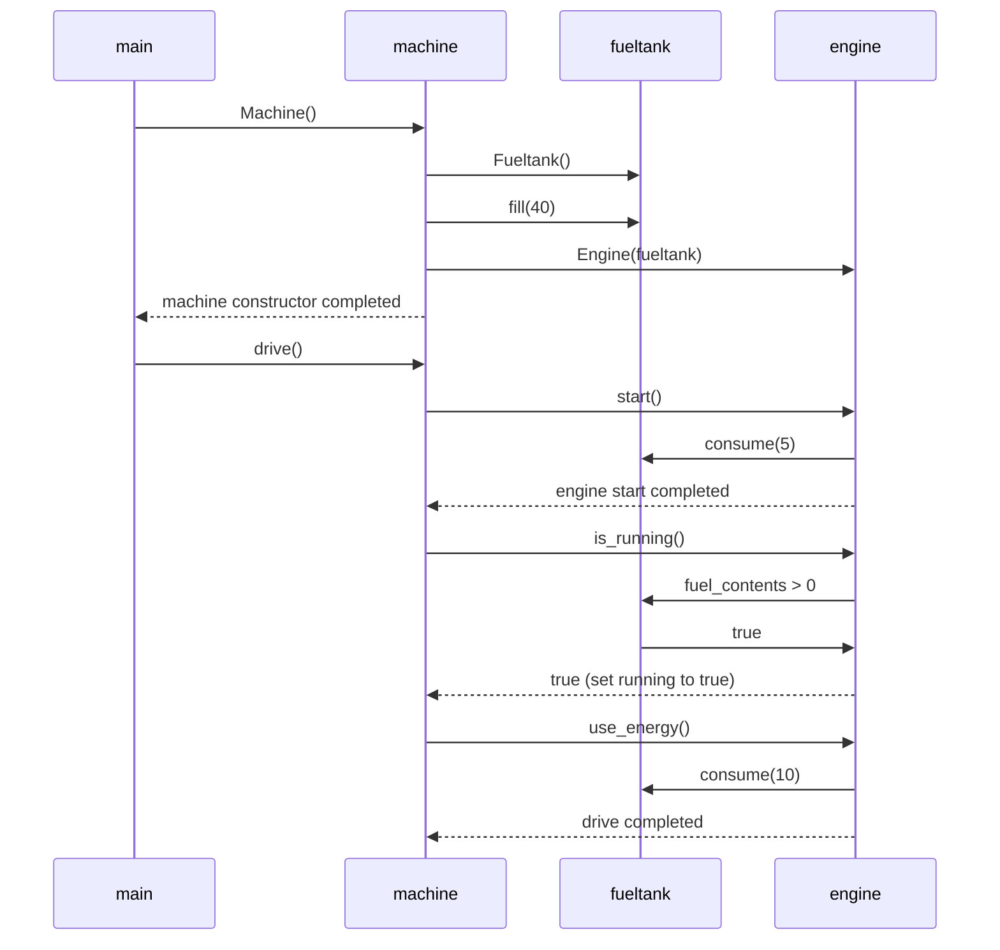

```mermaid
sequenceDiagram
    main->>machine: Machine()
    machine->>fueltank: Fueltank()
    machine->>fueltank: fill(40)
    machine->>engine: Engine(fueltank)
    machine-->>main: machine constructor completed
    main->>machine: drive()
    machine->>engine: start()
    engine->>fueltank: consume(5)
    engine-->>machine: engine start completed
    machine->>engine: is_running()
    engine->>fueltank: fuel_contents > 0
    fueltank->>engine: true
    engine-->>machine: true (set running to true)
    machine->>engine: use_energy()
    engine->>fueltank: consume(10)
    engine-->>machine: drive completed
```
